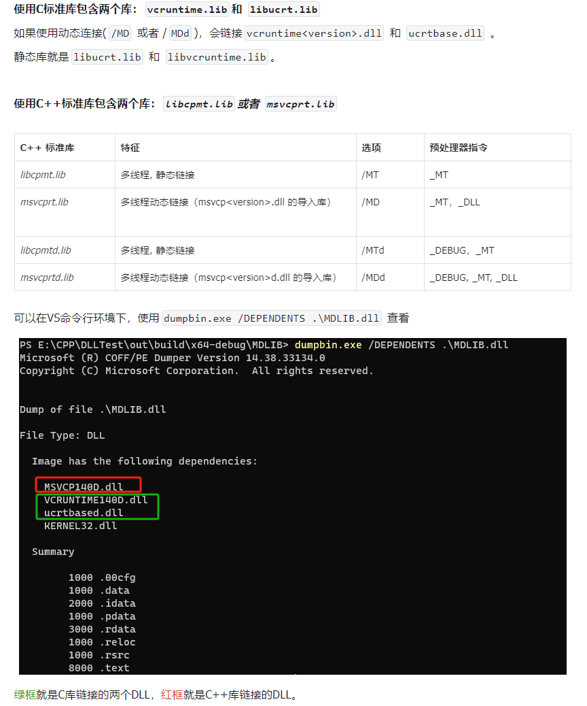

# 动态库使用和Install指令

一般自己项目拆成静态库。

# 1 动态库 
## 1.1 封装动态库文件

书接上回，包装只有动态库文件的项目应该怎么做，这里把上节的glfw项目替换成现在项目这样只有动态库和头文件。

那么现在要做的重点就是用`INTERFACE`选项，见下面`CMakeLists.txt`代码

该选项和`PUBLIC`相似，不过内容不给自身项目使用

也就说`target_include_directories`添加头文件，然后使用这个选项，自身项目写代码时还去include这头文件会提示找不到。


```cmake
# glfw
#     │  CMakeLists.txt
#     │
#     ├─bin
#     │      glfw3.dll
#     │
#     ├─include
#     │  └─GLFW
#     │          glfw3.h
#     │          glfw3native.h
#     │
#     └─lib
#             glfw3dll.lib
# glfw动态库子项目
project(glfw)

# 仅共享动态库，没有源文件
add_library(
    ${PROJECT_NAME}
    INTERFACE
)

# 这里把头文件共享给引用的项目
target_include_directories(
    ${PROJECT_NAME}
    INTERFACE
    include
)

target_link_directories(
    ${PROJECT_NAME}
    INTERFACE
    lib
)

target_link_libraries(
    ${PROJECT_NAME}
    INTERFACE
    glfw3dll
)

```

## 1.2 使用场景
开头所写 `一般自己项目拆成静态库。` 为什么呢？

因为动态库巨麻烦，有一堆需要考虑的事情，**作者没有全面学习，这里写的是个人见解**。

**目的：**
- 节省内存：需要时加载
- 节省外存：只有一份副本，不会链接进执行文件里
- 热更新
- 加快生成速度，编译可以并行，链接只能串行，把链接时机推后
- 统一库的版本，不同库可能链接统一库的不同版本导致符号冲突，或者执行时因为内存布局不同导致崩溃，比如[MSVC例子](https://learn.microsoft.com/zh-cn/cpp/c-runtime-library/potential-errors-passing-crt-objects-across-dll-boundaries?view=msvc-170#causes)

**缺点：**
- 符号冲突编译器不能帮忙检测，比如：两个动态库写了一样的函数名。
- 依赖关系：典型的protobuf库版本问题，要手动处理依赖库。

CMake默认链接MSVC的动态库，xmake则是静态库。



# 2 Install 指令
## 2.1 找不到glfw3.dll
修改完后运行一下项目，会报错找不到glfw3.dll

把

`本地路径\LearnOpenGLWithCMake\02_DynamicAndInstall\3rd\glfw\lib\glfw3.dll`

复制到

`本地路径\LearnOpenGLWithCMake\02_DynamicAndInstall\out\build\x64-debug`

复制到这个目录下，然后在运行程序，可以正常运行。

当然也可以把DLL所在目录加入到系统环境里，或者在程序使用系统api路径加载动态库。

那为什么选择第一种方法？因为我看其它软件都是这么做的。

Windosw加载顺序参考：https://learn.microsoft.com/zh-cn/windows/win32/dlls/dynamic-link-library-search-order

## 2.2 Install使用
上面步骤可以可以用Install指令简化：
```cmake
project(glfw)

add_library(
    ${PROJECT_NAME}
    INTERFACE
)

target_include_directories(
    ${PROJECT_NAME}
    INTERFACE
    include
)

target_link_directories(
    ${PROJECT_NAME}
    INTERFACE
    lib
)

target_link_libraries(
    ${PROJECT_NAME}
    INTERFACE
    glfw3dll
)

# 安装dll
install(
    FILES  ${CMAKE_CURRENT_SOURCE_DIR}/lib/glfw3.dll
    DESTINATION bin
)

```

现在在VS的运行目标找到`02_DynamicAndInstall(安装)`然后运行，找不到DLL的提示就消失了，取而代之的是正常运行。

其它IDE在运行安装后可以到`out/install`下查看，程序和dll都在一个目录下，直接运行即可。

# 3 简化 git clone
那么介绍了回字的两种写法（导入第三方库的两种方法），现在在介绍一种。

这等同于 `git clone https://github.com/glfw/glfw.git` 然后 `git checkout 自取分支名 3.3.9`。


```cmake
...
include(fetchcontent)      # 照写，不需要修改
 fetchcontent_declare(
    glfw        #库名字
    GIT_REPOSITORY https://github.com/glfw/glfw.git        # 仓库地址
    GIT_TAG 3.3.9 # 库版本
    SOURCE_DIR ${CMAKE_CURRENT_SOURCE_DIR}/3rd/glfw         # 指定库下载地址
)

fetchcontent_makeavailable(glfw)
...
```
**不过我还是推荐第一节课的方法使用 `git submodule` 管理版本，然后视情况编译成动态库还是静态库。**

当然包管理的方法我也是推荐的，下节会介绍。