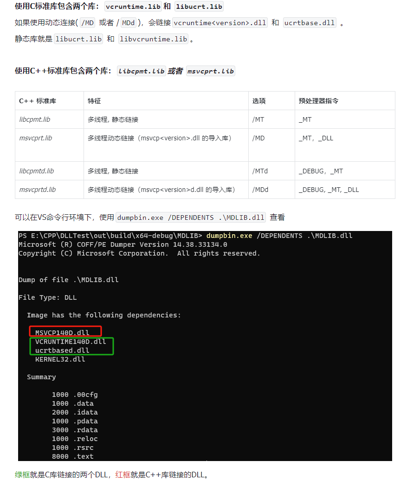

# 动态库使用和Install指令

一般自己项目拆成静态库。

# 1 动态库 
## 1.1 封装动态库文件

书接上回，包装只有动态库文件的项目，用`INTERFACE`选项，和`PUBLIC`相似，不过内容不给自身项目使用。

也就说`target_include_directories`添加头文件，自身项目时不会去添加的。

举个例子，把编译好的glfw动态库（这个项目没有用这方法）：

```cmake
# glfw
#     │  CMakeLists.txt
#     │
#     ├─bin
#     │      glfw3.dll
#     │
#     ├─include
#     │  └─GLFW
#     │          glfw3.h
#     │          glfw3native.h
#     │
#     └─lib
#             glfw3dll.lib
# glfw动态库子项目
project(glfw)

# 仅共享动态库，没有源文件
add_library(
    ${PROJECT_NAME}
    INTERFACE
)

# 这里把头文件共享给引用的项目
target_include_directories(
    ${PROJECT_NAME}
    INTERFACE
    include
)

target_link_directories(
    ${PROJECT_NAME}
    INTERFACE
    lib
)

target_link_libraries(
    ${PROJECT_NAME}
    INTERFACE
    glfw3dll
)

```

## 1.2 使用场景
开头所写 `一般自己项目拆成静态库。` 为什么呢？

因为动态库巨麻烦，有一堆需要考虑的事情，**作者没有全面学习，这里写的是个人见解**。

**目的：**
- 节省内存：需要时加载
- 节省外存：只有一份副本，不会链接进执行文件里
- 热更新
- 加快生成速度，编译可以并行，链接只能串行，把链接时机推后
- 统一库的版本，不同库可能链接统一库的不同版本导致符号冲突，或者执行时因为内存布局不同导致崩溃，比如[MSVC例子](https://learn.microsoft.com/zh-cn/cpp/c-runtime-library/potential-errors-passing-crt-objects-across-dll-boundaries?view=msvc-170#causes)

**缺点：**
- 符号冲突编译器不能帮忙检测，比如：两个动态库写了一样的函数名。
- 依赖关系：典型的protobuf库版本问题，要手动处理依赖库。

CMake默认链接MSVC的动态库，xmake则是静态库。



# Install
修改完后运行一下项目，会报错找不到glfw3.dll
这时候你在生成目录：`本地路径\LearnOpenGLWithCMake\02_DynamicAndInstall\out\build\x64-debug`
可以看到`02_DynamicAndInstall.exe`执行文件
把`本地路径\LearnOpenGLWithCMake\02_DynamicAndInstall\3rd\glfw\lib\glfw3.dll`复制到这个目录下，然后在运行程序，可以正常运行。

这个步骤可以可以用Install指令简化：
```cmake
# glfw
#     │  CMakeLists.txt
#     │
#     ├─bin
#     │      glfw3.dll
#     │
#     ├─include
#     │  └─GLFW
#     │          glfw3.h
#     │          glfw3native.h
#     │
#     └─lib
#             glfw3dll.lib
# glfw动态库子项目
project(glfw)

# 仅共享动态库，没有源文件
add_library(
    ${PROJECT_NAME}
    INTERFACE
)

# 这里把头文件共享给引用的项目
target_include_directories(
    ${PROJECT_NAME}
    INTERFACE
    include
)

target_link_directories(
    ${PROJECT_NAME}
    INTERFACE
    lib
)

target_link_libraries(
    ${PROJECT_NAME}
    INTERFACE
    glfw3dll
)

# 安装dll
install(
    FILES  ${CMAKE_CURRENT_SOURCE_DIR}/lib/glfw3.dll
    DESTINATION bin
)

```